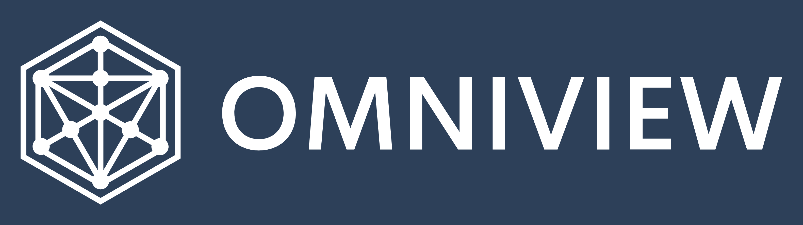

 

    
    

<h3 align="center">The future-proof, highly extendable IDE for DevOps engineering, transforming how you visualize, manage, and interact with your infrastructure.</h3>

 

    
    &nbsp;
    
    &nbsp;
	
    &nbsp;
    

    
    &nbsp;
    
    &nbsp;
    

        

<h2>What is Omniview?</h2>

Omniview is a groundbreaking Integrated Development Environment (IDE) tailored specifically for DevOps engineers. It redefines the concept of infrastructure management by offering a unified platform to visualize, manage, and operate across clouds, environments, and hosting platforms. Inspired by the principles of extensibility and efficiency, Omniview integrates seamlessly with your existing tools, enhancing them with a powerful plugin system that propels your operational workflow into the future.

## Key Features

- **Unified Interface**: A singular, intuitive gateway to manage your entire infrastructure landscape.
- **Extensible Plugin System**: Tailor Omniview to your needs, leveraging an ecosystem of plugins for comprehensive infrastructure management.
- **Cross-Cloud Compatibility**: Seamlessly integrate with AWS, Azure, Google Cloud, and more, for a truly unified cloud management experience.
- **Kubernetes and Cloud-Native Support**: First-class support for Kubernetes and cloud-native technologies, ensuring that you're equipped for the future of infrastructure.
- **Real-Time Visualization**: Dive deep into your infrastructure with dynamic, real-time visualizations that bring clarity to complex environments.

## Why Omniview?

In the fast-paced world of DevOps, engineers need tools that are not only powerful but also adaptable and intuitive. Omniview bridges the gap between complexity and usability, offering a platform that grows with you. It's not just about managing infrastructure; it's about empowering DevOps engineers with a workflow that’s as innovative as they are.

## Getting Started

To begin transforming your DevOps experience with Omniview, follow these steps:

1. **Install Omniview**: Download the latest version from our [releases page](https://github.com/omniviewdev/omniview/releases).
2. **Explore Plugins**: Dive into our plugin ecosystem and customize your environment. [Discover plugins](https://omniview.dev/plugins).
3. **Connect Your Infrastructure**: Easily connect Omniview to your cloud and hosting platforms, setting up your unified workspace.
4. **Enjoy Unified DevOps**: Start managing and visualizing your infrastructure like never before.

## Documentation

For detailed instructions, tutorials, and API documentation, visit our [official documentation](https://omniview.dev/docs).

## Community and Support

Join the growing community of Omniview users and contributors! For support, discussion, and sharing insights:

- [Discord](https://discord.gg/omniview) - Join our Discord server for live discussions.
- [GitHub Issues](https://github.com/omniviewdev/omniview/issues) - Report bugs or request features directly through our GitHub issues.

## Contributing

We welcome contributions from the community! If you're interested in making Omniview even better, check out our [contributing guidelines](https://github.com/omniviewdev/omniview/blob/main/CONTRIBUTING.md) for more information on getting started.

## License

Omniview is open-source software licensed under the [AGPL-3.0 License](LICENSE).

---

Transform your DevOps workflow today with **Omniview** - the extendable IDE where innovation meets infrastructure.
